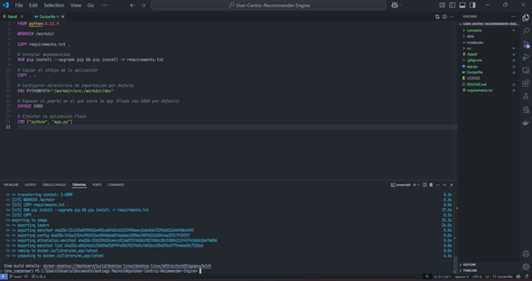
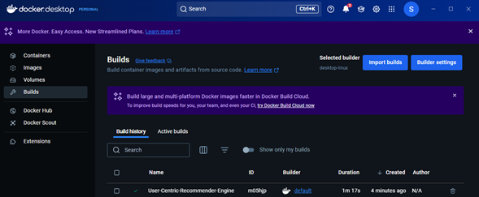
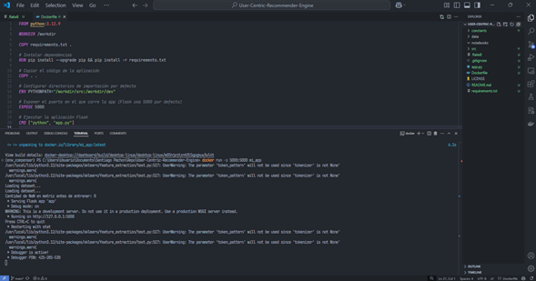
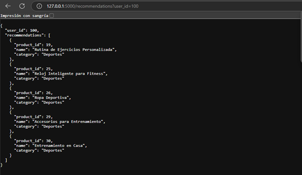
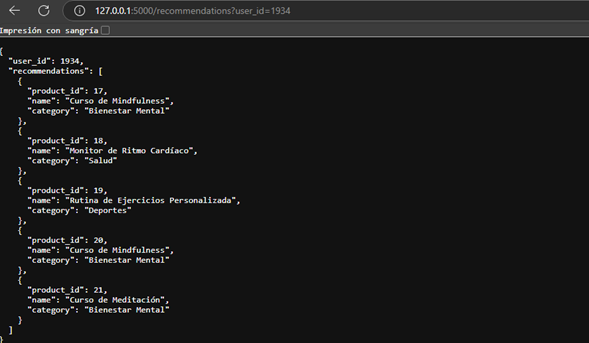

# User-Centric-Recommender-Engine

User-Centric-Recommender-Engine es un sistema de recomendación basado en machine learning y procesamiento de lenguaje natural (NLP), diseñado para generar recomendaciones personalizadas de productos según interacciones en una aplicación. El modelo combina un enfoque híbrido que incorpora el historial de interacciones del usuario, características personales y similitudes semánticas entre productos para mejorar la relevancia de las sugerencias.

##### Características principales

- Recomendaciones personalizadas: Utiliza el historial de interacción y los intereses declarados del usuario.

- Modelo híbrido: Combinación de filtrado colaborativo, características del usuario y procesamiento de palabras clave.

- Análisis de similitud: Uso de cosine similarity y Nearest Neighbors para identificar productos relevantes.

- Escalabilidad: Procesamiento eficiente de grandes volúmenes de datos mediante scipy y sklearn.

- Optimización de datos: Codificación categórica, normalización y vectorización de intereses.

Este documento proporciona instrucciones detalladas sobre cómo configurar y utilizar el entorno de desarrollo local, así como las políticas de trabajo con el repositorio remoto.


## Tabla de Contenidos
[1. Metologia, datos y tecnologias aplicadas](#1-metologia,-datos-y-tecnologias-aplicadas)

[2. Configuración del Entorno de Desarrollo Local](#2-configuración-del-entorno-de-desarrollo-local)  
 > [2.1. Clonar el Repositorio](#21-clonar-el-repositorio)  
 > [2.2. Organización de carpetas en el repositorio](#22-organización-de-carpetas-en-el-repositorio) 
 > [2.3. Configuración de entorno mediante Docker](#23-configuración-de-entorno-mediante-docker)

[3. Cómo Hacer `Push` al Repositorio Remoto](#3-cómo-hacer-push-al-repositorio-remoto)  
> [3.1. Creación de Ramas de Funcionalidad `feature`](#31-creación-de-ramas-de-funcionalidad-feature)  
> [3.2. Configuración del Hook de Pre-push](#32-configuración-del-hook-de-pre-push)
> [3.3. ¿Qué Hace el Hook de Pre-push?](#33-qué-hace-el-hook-de-pre-push)  
> [3.4. Hacer `Push` a la Rama de Funcionalidad](#34-hacer-push-a-la-rama-de-funcionalidad)
> [3.5. Otros Flujos de Git Flow: `hotfix`, `release`, y más](#35-otros-flujos-de-git-flow-hotfix-release-y-más)  
> [3.6. Resumen de Git Flow](#36-resumen-de-git-flow)

[4. Consideraciones Finales](#4-consideraciones-finales)  
[5. Control de versiones (Change Log)](#5-control-de-versiones-change-log)  

## 1. Metologia, datos y tecnologias aplicadas
Para desarrollar el sistema de recomendaciones, se utilizaron tres bases de datos en formato CSV:

- Usuarios (users.csv): Contiene información sobre los usuarios de la plataforma, incluyendo datos demográficos (edad, género, nivel de ingresos, educación y ubicación), comportamiento de navegación (frecuencia de inicio de sesión, dispositivo de acceso) y preferencias (intereses, tipo de suscripción y categoría de cliente).

- Productos (products.csv): Incluye información detallada de los productos y servicios ofrecidos en la plataforma, como identificador, nombre, categoría, descripción, palabras clave, precio, calificación promedio, descuento aplicado y disponibilidad en stock.

- Interacciones (interactions.csv): Registra la interacción de los usuarios con los productos, indicando el tipo de interacción (por ejemplo, visualización, compra o reseña), la calificación otorgada y comentarios sobre el producto.

Antes de alimentar el modelo, se realizaron procesos de limpieza, transformación y normalización de los datos, estandarizando formatos y convirtiendo información categórica en representaciones numéricas para facilitar el análisis y la generación de recomendaciones.

### 1.1 Metodología de Recomendación
Para generar recomendaciones personalizadas, se implementaron modelos basados en filtrado colaborativo y sistemas híbridos.

🔹 Filtrado Colaborativo: Utiliza el historial de interacciones de los usuarios para sugerir productos similares a aquellos con los que han interactuado previamente. Se aplicaron algoritmos basados en similitudes entre usuarios y productos mediante técnicas de factorización de matrices.

🔹 Modelo Basado en Contenido: Analiza las características de los productos (categoría, palabras clave y descripción) y las preferencias declaradas de los usuarios para ofrecer recomendaciones alineadas con sus intereses.

🔹 Sistema Híbrido: Combina ambas estrategias para mejorar la precisión de las recomendaciones, aprovechando la información explícita de los productos y el comportamiento implícito de los usuarios en la plataforma.

### 1.2 Tecnologías Utilizadas y Arquitectura del Sistema
El desarrollo del sistema de recomendaciones se basa en una arquitectura escalable, utilizando tecnologías modernas:

🔹 Lenguaje de programación: Python (con bibliotecas como Pandas, NumPy, Scikit-learn, Surprise para el modelado de datos y generación de recomendaciones).
🔹 Base de datos: se utilizaron los datos raw .csv
🔹 API REST: FastAPI para exponer el sistema de recomendaciones mediante endpoints accesibles.
🔹 Despliegue: Docker para la contenedorización, permitiendo escalabilidad y portabilidad.

El flujo del sistema se compone de la ingesta de datos, preprocesamiento, entrenamiento de modelos, generación de recomendaciones y su exposición a través de la API REST.

## 2. Configuración del Entorno de Desarrollo Local
Para configurar el entorno de desarrollo local, sigue los pasos a continuación para clonar el repositorio, instalar dependencias, usar las herramientas disponibles y ejecutar la aplicación. Esta puede ser ejecutada dentro de un contenedor de Docker, o empleando un ambiente virtual, según las preferencias del desarrollador.

### 2.1. Clonar el Repositorio
Para comenzar, clona el repositorio del proyecto en tu máquina local y añádelo a tu directorio de trabajo (ejemplo para macOS):

```bash
git clone https://github.com/SantiagoPachon77/User-Centric-Recommender-Engine.git
cd User-Centric-Recommender-Engine
```

### 2.2. Organización de carpetas en el repositorio
* `constants`: contiene un archivo, _constants.py_. En ella, se guardan variables estáticas dentro del proceso, como por ejemplo las categorias del arbol taxonomico de MELI
* `data`: este directorio se usa para el desarrollo en local de procesos. En él, se destinan los archivos planos (_.csv_) como users, products y interactions. Todos sus archivos son ignorados al hacer _push_, por lo que también sirve para trabajar desarrollos temporales.
* `notebooks`: contiene el archivo _.ipynb_. utilizados en la fase de descubrimiento y entendemiento de datos, desarrollo y estructuracion del motor de recomendación
* `reports`: Contiene algunos archivos _.html_ del perfilamiento
* `src`: contiene el código fuente que se llama la app, como el procesamiento de los productos, usuarios, modelado y el recomendador _.py_.

Este proyecto maneja un solo archivo _.gitignore_, en la ruta base del repositorio y dentro de él se especifican las extensiones y rutas de archivos a ignorar.

```
.
📂 constants
│   └── constants.py
📂 data
│   ├── interactions.csv
│   ├── products.csv
│   └── users.csv
📂 img
│   ├── contenedor_corriendo.png
│   ├── contenedor_creado.png
│   ├── creacion_imagen.png
│   ├── request_prueba1.png
│   ├── request_prueba2.png
│   ├── request_prueba3.png
│   └── request_sucessfully.png
📂 notebooks
│   └── 01_modelado_base.ipynb
📂 reports
│   ├── report_products.html
│   ├── report_users.html
│   └── report_interactions.html
📂 src
│   ├── __init__.py
│   ├── data_procesing.py
│   ├── model.py
│   ├── recomender.py
│   └── utils.py
├── .flake8
├── .gitignore
├── app.py
├── Dockerfile
├── LICENSE
├── readme.md
├── requirements.txt


```

### 2.3. Configuración de entorno mediante Docker
Al emplear esta opción de desarrollo, todas las herramientas y dependencias necesarias se gestionan a través de Docker, por lo que no necesitas instalar dependencias adicionales de Python u otros lenguajes de forma manual.

Puedes ejecutar el contenedor Docker con la aplicación configurada utilizando el siguiente comando:

```bash
docker build -t mi_app .   
```
asi se ve desde la terminal:



asi se ve desde docker desktop:



El comando anterior ejecuta y creara la imagen. Una vez creada la imagen debe ejecutar


```bash
docker run -p 5000:5000 mi_app
```
asi se ve desde la terminal:



Ahora si queremos probar la app, colocamos el siguiente endpoint:

```bash
http://127.0.0.1:5000/recommendations?user_id=100
```

Como resultado tenemos un formato request con una lista de productos/servicios recomendados para un usuario específico. en este caso para el usuario 100



podemos probar para usuarios con id desde (1 - 1999), acá se muestra dos pruebas más. Solo se debe cambiar el valor en el endpoint como sigue:


```bash
http://127.0.0.1:5000/recommendations?user_id=1222
```


```bash
http://127.0.0.1:5000/recommendations?user_id=1934
```




A continuación, encuentras una lista corta de comandos útiles al trabajar con este entorno.
* Para finalizar la ejecución de la aplicación interactiva con terminal: 
```bash
exit
``` 

* Para obtener un listado de las imágenes de Docker construidas en la máquina local (fuera del contenedor): 
```bash
docker images
``` 

* Para obtener un listado de contenedores actualmente corriendo en la máquina local (fuera del contenedor): 
```bash
docker ps
``` 

Si llega a construirse la imagen sobre un desarrollo incompleto o que tenga algún error, es necesario eliminar esta imagen y construir una nueva, con las correcciones necesarias.
* Para eliminar una imagen de Docker desde la terminal (después de asegurarse que el contenedor no está corriendo):

```bash
docker rmi <image_id o image_name>
``` 

La imagen también puede eliminarse desde la aplicación de escritorio de Docker. Otros comandos comúnes de Docker están disponibles en [este enlace](#https://docs.docker.com/reference/cli/docker/).


## 3. Cómo Hacer `Push` al Repositorio Remoto
Este proyecto sigue la metodología **Git Flow**, que es una estrategia de ramificación que facilita el trabajo en equipo y la gestión del ciclo de vida del desarrollo de software. En Git Flow, hay varios tipos de ramas que se utilizan para organizar las diferentes etapas del desarrollo y despliegue de nuevas funcionalidades, correcciones de errores, y lanzamientos. A continuación, se explica cómo trabajar con Git Flow para hacer `push` al repositorio remoto y otros flujos importantes:

### 3.1. Creación de Ramas de Funcionalidad (`feature`)
Cuando trabajes en una nueva funcionalidad o corrección de errores, debes crear una nueva rama a partir de `develop` con el prefijo `feature/` seguido de un nombre descriptivo de la funcionalidad. Esto asegura que cada cambio esté aislado hasta que esté listo para integrarse en `develop`. Por ejemplo:

```bash
git checkout -b feature/nueva-funcionalidad
```

Una vez que hayas terminado de trabajar en la rama de funcionalidad y estés listo para integrar los cambios en `develop`, asegúrate de que tu código pase todas las pruebas y linters. Luego, puedes hacer `push` a la rama de funcionalidad:

```bash
git push origin feature/nueva-funcionalidad
```

**Nota:** No hagas `push` directamente a las ramas `develop` o `master`.

### 3.2. Configuración del Hook de Pre-push
Antes de hacer un `push`, es necesario configurar un hook de pre-push para asegurarse de que el código cumpla con los estándares de calidad establecidos. El hook de pre-push se encuentra en el directorio `dev/` y debe copiarse al directorio de hooks de Git (`.git/hooks`).

Para copiar el hook de pre-push y hacerlo ejecutable, utiliza los siguientes comandos:

```bash
cp dev/prepush .git/hooks/pre-push
chmod +x .git/hooks/pre-push
```

### 3.3. ¿Qué Hace el Hook de Pre-push?
El hook de pre-push es un script que se ejecuta automáticamente antes de que Git permita hacer un `push` al repositorio remoto. Este hook ejecuta los linters para asegurar que el código cumple con los estándares de estilo y calidad definidos. Si se encuentran problemas de linting, el `push` se bloquea y se proporciona un informe de errores para que puedan corregirse.

### 3.4. Hacer `Push` a la Rama de Funcionalidad
Después de configurar el hook de pre-push y validar que no hay errores de linting, puedes hacer `push` a tu rama de funcionalidad:

```bash
git push origin feature/nueva-funcionalidad
```

En caso de tener problemas relacionados con la generación de la imagen en Docker, se recomienda primero construir la imagen de Docker en local, como se explica en la sección [1.2](#12-configuración-de-entorno-mediante-docker).

### 3.5. Otros Flujos de Git Flow: `hotfix`, `release`, y más
Git Flow también admite otros flujos de trabajo importantes además de las ramas de funcionalidad (`feature`):

- **`hotfix`**: Utiliza ramas de `hotfix` para aplicar correcciones rápidas y urgentes directamente en la rama `master`. Esto es útil cuando necesitas corregir un error crítico en producción. Para crear una rama de hotfix, puedes utilizar:

  ```bash
  git checkout -b hotfix/nombre-del-hotfix master
  ```

  Una vez que se complete el hotfix, se fusionará tanto en `master` como en `dev` para mantener ambas ramas actualizadas.

- **`release`**: Las ramas de `release` se utilizan para preparar una nueva versión de la aplicación para su despliegue. Cuando la rama `dev` esté lista para un nuevo lanzamiento, puedes crear una rama de `release`:

  ```bash
  git checkout -b release/v1.0.0 dev
  ```

  Esta rama se utiliza para pruebas finales y ajustes menores antes de fusionarse en `master` y etiquetarse con el número de versión.

- **`support`**: A veces es necesario mantener múltiples versiones de producción. Las ramas de `support` se pueden usar para admitir y corregir versiones antiguas mientras se continúa el desarrollo en `master`.

### 3.6. Resumen de Git Flow
Git Flow es una metodología robusta que permite un desarrollo organizado, control de versiones eficiente, y la capacidad de responder rápidamente a problemas en producción mediante el uso de ramas estructuradas y predefinidas. Adoptar esta metodología permite a los equipos de desarrollo colaborar más eficazmente y mantener la estabilidad del código en cada fase del ciclo de vida del desarrollo.

Asegúrate de seguir estas prácticas para contribuir de manera efectiva al proyecto y mantener un flujo de trabajo de desarrollo limpio y ordenado.


## 4. Consideraciones Finales
- Asegura de tener Docker instalado y configurado en tu sistema.
- Utiliza los comandos proporcionados en este documento para manejar todas las etapas del desarrollo, desde la construcción del entorno hasta el despliegue y mantenimiento.

**Evaluación del Modelo**

Para medir la efectividad de las recomendaciones, se han utilizado las siguientes métricas:

- **MAP@K (Mean Average Precision at K):** 0.0011  
- **NDCG@K (Normalized Discounted Cumulative Gain at K):** 0.9288  
- **HR@K (Hit Rate at K):** 0.0053  
- **MRR (Mean Reciprocal Rank):** 0.00126  

**Análisis y Mejoras**

El modelo muestra un **NDCG@K alto (0.92)**, lo que indica que los elementos recomendados están bien ordenados en relación con la relevancia. Sin embargo, el **MAP@K y HR@K son bajos**, lo que sugiere que las recomendaciones pueden no ser del todo precisas. esto puede ser debido a que los datos presentan insconsistencias en su creación.

**Posibles mejoras:**
- Ajustar tendencias temporales y **LSTM** para manejo de patrones temporales 
- Explorar técnicas de **re-rankeo** basadas en características adicionales del usuario.  
- Incluir técnicas de **aprendizaje profundo** o embeddings para mejorar la representación de los productos.  

## 5. Control de versiones (Change Log)
* **27/02/2025 - v0.0.1**  
Versión preliminar que contiene los comandos de ejecución despliegue docker y ejecución de la app<br/>
Santiago Pachon R. - MSc Advanced Analytics